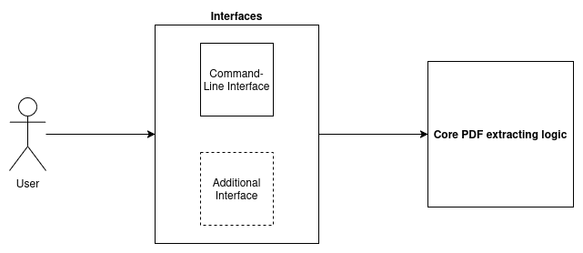

# Software Requirements Specification (SRS)

This document is used to list the description, purpose, scope, functional requirements, and non functional requirements of `pdfextract` to streamline its development.

---

## 1. Description

First, a short description of `pdfextract` and its intended functionality will be provided.

### 1.1 Product Perspective

The idea of a simple command-line tool to extract pages of a PDF arose out of a need to generate documents from specific pages of larger documents. The need was satisfied by online tools, then by Python scripts. A formal, documented CLI for the tool is the next step.

### 1.2 Product Features

`pdfextract` is can be used to generate a PDF consisting of pages (specified as page numbers) from another file. The specified pages can be:

- a single page,

- a list of pages, or

- a range of pages.

### 1.3 Operating Environment

This tool is being developed for cross-platform use on Linux, Windows, and MacOS operating systems. It fits most well in the Linux ecosystem, aspiring to the UNIX philosophy of a small program that does one particular task very well.

---

## 2. Functional Requirements

1. The system shall allow the user to input a filename of a PDF file for pages to be extracted from.

2. The system shall allow the user to specify a single page to be extracted from the PDF file by its page number.

3. The system shall allow the user to specify a list of page numbers to be extracted from the PDF file.

4. The system shall allow the user to specify a range of pages by the starting page number of the range and the ending page number of the range to be extracted from the PDF file.

5. The system shall allow the user to specify a range of pages from a particular page (inclusive) to the end of the PDF file to be extracted, without knowing the number of pages in the PDF file.

6. The system shall generate a PDF file consisting of only the pages they specified from the input PDF file.

7. The system shall inform the user if any of the pages they specified to be extracted do not exist in the PDF file, without generating an output PDF file.

8. The system shall allow the user to specify a file name for the output PDF file.

9. The system shall inform the user if the path they specified for the output PDF file does not exist, without generating an output PDF file.

10. The system shall allow the user to leave the output PDF filename unspecified.

11. If the user does not specify a filename for the output PDF file, the system shall generate the output PDF file in the user's current working directory with a filename that does not conflict with any of the files in the directory.

---

## 4. Non-Functional Requirements

1. The system shall work the same way on Linux, Windows, and MacOS environments.

2. The system shall inform the user if there are any problems with the programming environment before proceeding with the PDF processing logic.

3. The system shall not keep any information about users or the files they process.

---

## 5. External Interfaces

Currently, the only interface intended for development is a command-line interface. However, the system should be developed in a modular way, allowing additional interfaces to be easily developed on top of the core PDF-processing logic.

---

## 6. System Models

The core PDF processing logic shall be separated from the interface logic, allowing additional interfaces to be easily added in the future.

